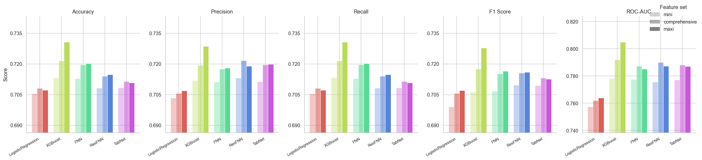
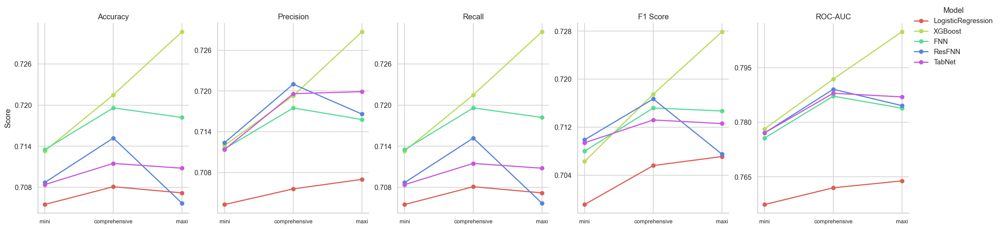
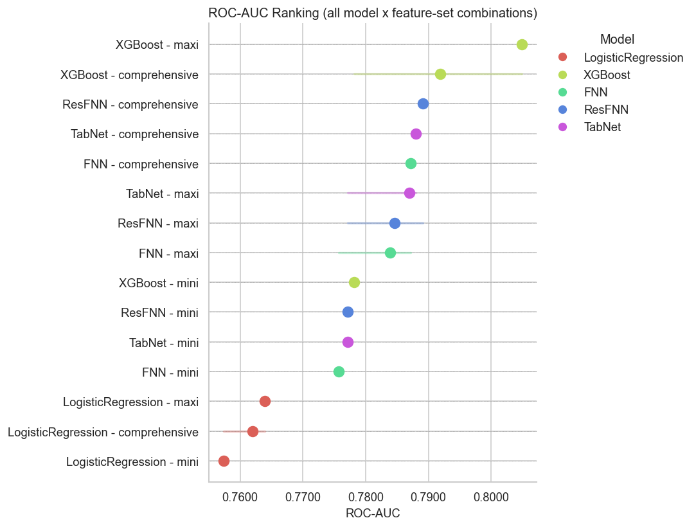

# Predicting American Football Plays

**A Machine Learning Approach for the Binary Classification of Pass and Run Plays**

Bachelor's Thesis — Wirtschaftsuniversität Wien (WU Vienna)

---

## Overview

This project develops and compares machine learning models for predicting whether an NFL offensive play will be a **pass** or a **run**, framed as a binary classification task. Using NFL play-by-play data from the 2016–2023 seasons (sourced via `nflreadpy`/nflverse), five model families are evaluated across three distinct feature sets of increasing size and complexity.

**Models compared:**
- Logistic Regression (baseline)
- XGBoost
- Feedforward Neural Network (FNN, PyTorch)
- Residual Feedforward Neural Network (ResFNN, PyTorch)
- TabNet (pytorch-tabnet)

**Feature sets:**
| Name | Size | Description |
|---|---|---|
| `mini` | ~7 features | Core situational variables (down, distance, shotgun, ...) |
| `comprehensive` | ~33 features | Extended game-state features (EPA, WP, time, ...) |
| `maxi` | ~121 features | Full feature space including team identity and OHE expansions |

---

## Repository Structure

```
.
├── config.py                  # params, paths, feature sets, thresholds
├── requirements.txt
├── notebooks/
│   ├── 01_exploration.ipynb
│   ├── 02_feature_selection_maxi.ipynb
│   ├── 02_feature_selection_mini.ipynb
│   ├── 03_classical_models.ipynb
│   ├── 04_fnn.ipynb
│   ├── 05_resfnn.ipynb
│   ├── 06_tabnet.ipynb
│   └── 07_results.ipynb
├── src/
│   ├── data_loader.py         # NFL data fetching and caching (parquet)
│   ├── preprocessing.py       # Encoding pipeline
│   ├── feature_selection.py   # Association-based feature filtering
│   ├── models.py              # Shared model utilities
│   ├── logistic_regression.py # Logistic Regression wrapper
│   ├── xgboost.py             # XGBoost wrapper
│   ├── fnn.py                 # PyTorch FNN + FNNWrapper (sklearn-compatible)
│   ├── resfnn.py              # Residual FNN variant
│   ├── tabnet.py              # TabNet training loop and hyperparameter config
│   └── evaluation.py          # Metrics, plots, error analysis helpers
└── outputs/
    ├── figures/
    │   ├── eda/
    │   └── models/
    └── results/
```

---

## Data

Play-by-play data is loaded via the [`nflreadpy`](https://github.com/nflverse/nflreadpy) package (nflverse). On first run, raw data is cached locally as a Parquet file at `data/cache/pbp_raw.parquet` to avoid repeated downloads.

**Train / Test Split (temporal):**
- Train: 2016–2021 (6 seasons)
- Test: 2022–2023 (2 seasons)

Special teams, penalties, and two-point conversion plays are excluded. Only standard scrimmage plays with a clearly defined pass/run outcome are retained.

---

## Setup

### Prerequisites

- Python 3.10+

### Installation

```bash
git clone https://github.com/Orangenraph/Predicting-American-Football-Plays.git
cd Predicting-American-Football-Plays
pip install -r requirements.txt
```

### Running the Notebooks

Notebooks are numbered and designed to be run in order:

```
01 → Feature exploration
02 → Feature selection (mini & maxi)
03 → Classical models (Logistic Regression & XGBoost)
04 → FNN experiments
05 → ResFNN experiments
06 → TabNet experiments
07 → Results & comparison
```

All paths are resolved automatically relative to `config.py` using `pathlib`, so no manual path configuration is needed.

---

## Results Summary

All models plateau around **71–73% accuracy** and **0.78–0.80 ROC-AUC** on the held-out test set, consistent with prior literature. XGBoost on the `maxi` feature set achieves the strongest single result (accuracy: 0.7307, ROC-AUC: 0.8049).





Key findings:
- XGBoost outperforms deep learning approaches (FNN, ResFNN, TabNet) on this tabular dataset
- The `maxi` feature set underperforms `comprehensive` for deep learning models, consistent with the Curse of Dimensionality
- No model exceeded ~73% accuracy, suggesting an inherent upper bound on play-call predictability in the NFL

---

## Hardware & Limitations

All experiments were conducted on a consumer-grade laptop with limited computational resources:

- **CPU:** AMD Ryzen 5 7520U (4 cores / 8 threads)
- **RAM:** 8 GB
- **GPU:** AMD Radeon Graphics (integrated, no CUDA support)

Due to these constraints, deep learning models (FNN, ResFNN, TabNet) were trained on CPU only, which significantly restricted the feasible hyperparameter search space and training time. Given more powerful hardware, the following extensions could likely improve results:

- **More seasons** — extending the training window beyond 2016–2021 to include earlier NFL data
- **Systematic hyperparameter tuning** — e.g. full grid search or Bayesian optimization for neural network architectures
- **Larger batch sizes and more epochs** — particularly beneficial for TabNet and ResFNN
- **GPU-accelerated training** — enabling deeper architectures and faster iteration

These limitations are an inherent part of the project scope and do not invalidate the comparative findings between model families.

---

## License

MIT License — see [LICENSE](LICENSE) for details.

---

<sub>README generated with the assistance of Claude Sonnet 4.6.</sub>